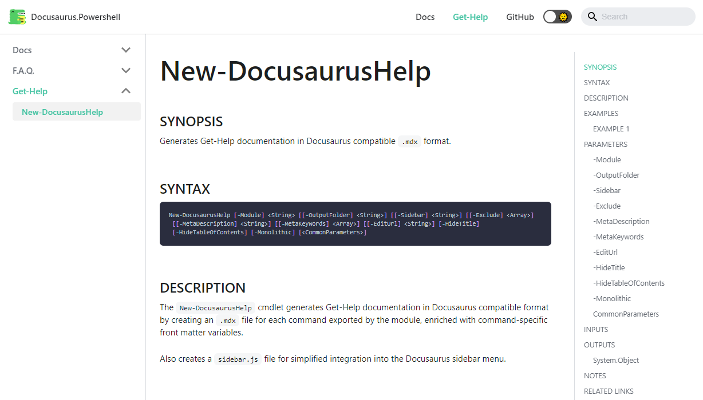

# Docusaurus.PowerShell

Documentation websites for PowerShell Modules (with auto-generated Get-Help pages).

## Live Demo

[https://docusaurus-powershell.netlify.app](https://docusaurus-powershell.netlify.app)

## Screenshot

## Who's Using This?

<!-- prettier-ignore-start -->
<!-- markdownlint-disable -->
<table>
  <tr>
    <td align="center"><a href="https://pester.dev/"> <h3>Pester</h3></td>
  </tr>
</table>

## Local Development

PowerShell 7, Pester 4:

- `cd /local/path/to/repo`
- `./Install-RequiredModules.s1`
- `dev/build-and-import-module.ps1`
- `Invoke-Pester`

> **Important:** after code changes, make sure to build-and-import the Alt3 module before running Pester!
